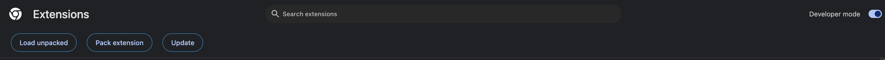

# Grove Chrome Extension <!-- omit in toc -->

- [Setup - Using the Extension](#setup---using-the-extension)
  - [One Time Setup - How to enable Beta extensions?](#one-time-setup---how-to-enable-beta-extensions)
  - [Recurring Setup - How to update to the latest version?](#recurring-setup---how-to-update-to-the-latest-version)
- [Development - Releasing the extension](#development---releasing-the-extension)

## Setup - Using the Extension

### One Time Setup - How to enable Beta extensions?

1. Go to [chrome://extensions](chrome://extensions)
2. Click `Developer mode` (top-right corner)

   

3. You can now install beta extensions by clicking `Load unpacked` and selecting the unzipped folder:

   

### Recurring Setup - How to update to the latest version?

0. Ensure you have followed the instructions above at least once.
1. [Download the latest release](https://github.com/buildwithgrove/grove-releases/releases/download/grove-extension-latest/grove-extension.zip)
2. Unzip the file on your computer and move it to a location of your choice.
3. Go to [chrome://extensions](chrome://extensions)
4. Click `Load unpacked` and select the unzipped folder

## Development - Releasing the extension

Coming soon.
