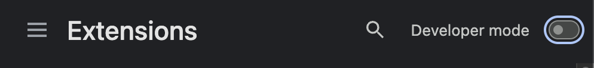
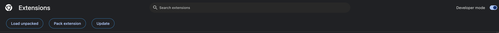

# Grove Releases <!-- omit in toc -->

Public releases for Grove products.

---

- [CLI](#cli)
- [Chrome Extension (Beta)](#chrome-extension-beta)
  - [Installation](#installation)
  - [Updating](#updating)

---

## CLI

One-liner install:

```bash
curl -fsSL https://grove.city/install-cli.sh | bash
```

- Cross-platform: macOS, Linux, Windows
- Full docs: https://grove.city/docs/cli

---

## Chrome Extension (Beta)

[](https://github.com/buildwithgrove/grove-releases/releases/latest)

### Installation

1. [**Download the latest zip**](https://github.com/buildwithgrove/grove-releases/releases/latest)
2. Unzip to a folder on your computer
3. Go to `chrome://extensions`
4. Enable **Developer mode** (top-right corner)

   

5. Click **Load unpacked** and select the unzipped folder

   

### Updating

When you see the update notification:

1. Download the new zip from the link in the banner
2. Unzip and replace the old folder
3. Go to `chrome://extensions` and click the **refresh icon** on the Grove card

> **Note:** Beta installs check for updates every 4 hours. Chrome Web Store installs update automatically.
